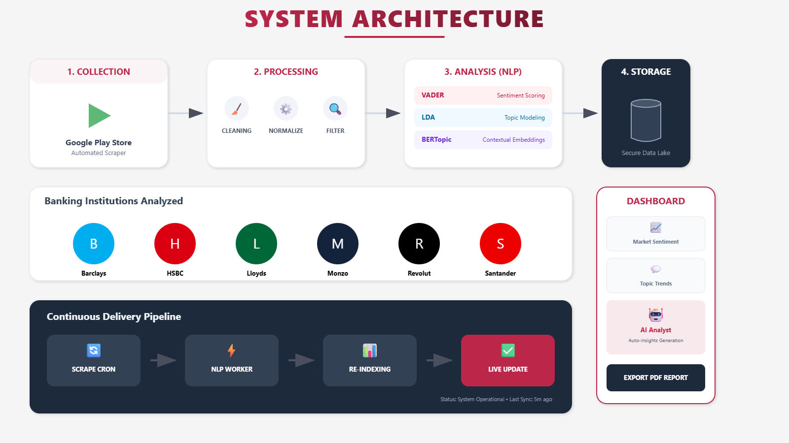

# 🏦 Banking App Reviews — UK Market

[](https://www.python.org/)
[](https://streamlit.io/)

## 🌟 Project Introduction

A comprehensive analysis of **user reviews from UK banking apps** collected via the **Google Play Store**, designed to uncover insights about customer satisfaction, app strengths, and areas for improvement across different banks.

This project represents a cutting-edge approach to understanding digital banking experiences through the lens of user feedback. By analyzing over 800,000 reviews from six major UK banking apps, we provide data-driven insights that can help financial institutions improve their mobile banking services, enhance customer satisfaction, and stay competitive in the rapidly evolving fintech landscape.

### 🎯 Key Objectives

- **Understand customer sentiment**: Analyze what users love and hate about their banking apps
- **Identify trends and patterns**: Discover common themes across different banks and time periods
- **Compare traditional vs digital banks**: Highlight differences between established banks and fintech disruptors
- **Provide actionable insights**: Offer concrete recommendations for improving banking app experiences
- **Enable data exploration**: Create interactive tools for stakeholders to explore the data themselves

### 💡 Why This Matters

In today's digital-first banking environment, mobile apps have become the primary interface between customers and their financial institutions. This analysis helps:

- **Banks** understand their customers better and prioritize app improvements
- **Fintech companies** identify opportunities in the competitive landscape
- **Consumers** make informed choices about which banking apps best suit their needs
- **Regulators** monitor the health of digital banking services
- **Researchers** access a comprehensive dataset of real-world banking app feedback

## 📊 Project Overview

This project provides a **data-driven analysis** of UK banking app reviews with a focus on:

- **Average user ratings** and trends over time
- **Volume of reviews** per app and per period
- **Key topics** discussed in positive and negative reviews
- **Comparative analysis** across banking apps
- **Interactive visualizations** for exploring insights

The methodology combines **text analytics**, **topic modeling**, and **interactive dashboards** to identify drivers of user perceptions of digital banking services in the UK.

---

## 🏗️ System Architecture



---

## 🔍 Data Source

- **Source:** Google Play Store reviews
- **Scope:** Six UK banking apps — Barclays, HSBC, Lloyds, Monzo, Revolut, Santander
- **Collection Method:** Automated scraping using `google_play_scraper`
- **Total Reviews Collected:** 826,905 unique reviews (initial scrape)
- **Time Period:** Early history through December 2025
- **Fields Collected:** `app_name`, `score`, `review_text`, `review_date`, `thumbs_up`, `reply`, `reply_date`, `app_version`

---

## 🧠 Methodology & Key Insights

### 1. Data Collection & Characteristics

**Review Distribution by App:**

| App Name   | Review Count | Percentage |
|------------|--------------|------------|
| Barclays   | 268,074      | 32.4%      |
| Revolut    | 265,788      | 32.1%      |
| Lloyds     | 150,762      | 18.2%      |
| Santander  | 80,171       | 9.7%       |
| HSBC       | 39,524       | 4.8%       |
| Monzo      | 22,586       | 2.7%       |

**Key Observations:**

- **Polarized Reviews:** 72.7% of reviews are 5-star; 12.2% are 1-star.
- **Engagement Paradox:** Negative reviews (1–2 stars) receive ~10× more thumbs-up than positive reviews.
- **Temporal Patterns:** Review volume peaked in 2019, decreased during 2020–2023, then rebounded in 2024.
- **Bank Response Rates:** Vary by bank (HSBC 54%, Lloyds 3.5%), with digital banks responding faster.

---

### 2. Data Processing Pipeline

**Final Clean Dataset:** 660,848 reviews (after cleaning and filtering)

**Cleaning Steps:**

- Text normalization (lowercase, URL removal, whitespace standardization)
- Parsing app versions (1,853 unique versions identified)
- Removing inconsistent sentiment-score reviews (422,533 removed)
- Filtering short reviews (minimum 4 words for modeling)

---

### 3. Sentiment Analysis (VADER)

- **Consistency:** ~94% of reviews have sentiment consistent with numeric score
- **Positive Sentiment Leaders:** Lloyds (83%), Barclays (80%)
- **Highest Negative Sentiment:** HSBC (24%)
- **Reply Sentiment:** Negative reply sentiment often indicates acknowledgment of problems rather than rudeness
- **Digital vs Traditional Banks:** Digital banks (Revolut, Monzo) have more balanced sentiment distributions

---

### 4. Topic Modeling Approaches

#### LDA Modeling

**General Model (7 topics):**

1. Cards & Payments
2. Customer Service
3. Updates & Access
4. Mobile Payments
5. Security & Travel
6. Account Management
7. Usability & Transfers

**Negative Reviews Model (6 topics):**

1. Login & Security
2. Customer Support
3. Technical Issues
4. Payments & Cards
5. Interface Problems
6. Mobile Payment Issues

**Positive Reviews Model (6 topics):**

1. Currency & Management
2. Transfers & Payments
3. Support & Updates
4. Security & Service
5. Features & Travel
6. Usability

**Insights from LDA:**

- Traditional banks: Struggle with core functionality and technical stability (46–65% negative reviews)
- Digital banks: Criticized for core features and fees (38–44% negative reviews)
- Investment features consistently praised (19–25% positive reviews)

#### BERTopic Modeling

**Dataset:** 391,346 reviews after cleaning

**Model Configuration:**

- **Embeddings:** Sentence-BERT (`all-MiniLM-L6-v2`)
- **Dimensionality Reduction:** UMAP (n_components=5, min_dist=0.1)
- **Clustering:** HDBSCAN (min_cluster_size=150)
- **Training Time:** ~85 minutes (61 min embeddings, 24 min clustering)

**Final Topics (20 topics with custom labels):**

| Topic ID | Label                  | Count   | %   | Keywords                          |
|----------|------------------------|---------|-----|-----------------------------------|
| 2        | Money Management       | 15,273  | 7.0%| finances easy, manage account, navigate quick |
| 7        | Travel & FX            | 10,389  | 4.8%| try log, freezing, logon          |
| 8        | Cards                  | 6,310   | 2.9%| euro, travels, good rates         |
| 10       | Compatibility & Launch Issues | 4,401 | 2.0%| version better, install use       |
| 15       | Updates                | 2,092   | 1.0%| balance widget, clear information |
| 19       | Referral Program       | 559     | 0.3%| saves going, use save             |

**Macro Categories (5 groups):**

1. User Experience (27.9%)
2. Products (8.8%)
3. Customer Service (5.0%)
4. Performance (13.3%)
5. Core Banking (34.7%)

**Advantages of BERTopic over LDA:**

- Handles short text effectively
- More coherent topic clusters with contextual embeddings
- Outlier reduction (from 40.1% to 22.9%)
- Balanced topic distribution

---

## 🧾 Project Structure

```
📁 Digital-Banking-Dashboard/
├── assets/                             # Directory for storing data assets and models
├── notebooks/                          # Jupyter notebooks for analysis
│   ├── 1. Data Collection.ipynb        # Data scraping and collection
│   ├── 2. Preprocessing and EDA.ipynb  # Data cleaning and exploratory analysis
│   ├── 3. Sentiment Analysis.ipynb     # VADER sentiment analysis
│   ├── 4.1. LDA Modelling.ipynb        # LDA topic modeling
│   └── 4.2. BERTopic Modelling.ipynb   # BERTopic modeling
├── reviews_core/                       # Core Python modules for the project
│   ├── __init__.py                     # Package initialization
│   ├── scraper.py                      # Google Play Store scraper
│   ├── cleaning.py                     # Data cleaning and preprocessing
│   ├── apply_bertopic.py               # Apply BERTopic to new data
│   ├── update_final_dataframes.py      # Update aggregated data
│   ├── word_cloud.py                   # Word cloud generation
│   └── get_sample.py                   # Sample review extraction
├── app.py                              # Main Streamlit dashboard application
├── run_pipeline.py                     # Script to run the full data pipeline
├── requirements.txt                    # Python dependencies
└── README.md                           # Project documentation

```

**Key Features:**

1. App Ratings: Trend analysis, filter by bank/time, interactive charts
2. Key Topics: Topic distributions, positive vs negative reviews, PDF reports
3. Search Reviews: Advanced search, word clouds, sentiment highlighting, CSV export
4. AI Analyst: Contextual AI insights based on reviews (optional)

---

## 🔧 Data Pipeline Modules

1. **`scraper.py`** – Fetch latest Google Play reviews
2. **`cleaning.py`** – Normalize and clean reviews
3. **`apply_bertopic.py`** – Assign BERTopic topics to reviews
4. **`update_final_dataframes.py`** – Update monthly and topic data
5. **`word_cloud.py`** – Generate word clouds for visualization
6. **`get_sample.py`** – Sample representative reviews

---

## 📊 Key Business Insights

### Pain Points

* Traditional banks: login, stability, basic usability
* Digital banks: core features, fees
* Universal: login failures, payment issues
* Security: authentication & account access

### Praise Patterns

* Feature-driven satisfaction
* Investment features highly appreciated
* Positive experiences are holistic
* Banks excel in different areas (e.g., Revolut: travel, HSBC: transactions)

### Strategic Implications

* Improve technical reliability for traditional banks
* Perfect core payment functions for digital banks
* Focus on investments and security for all banks
* Customer service response optimization


---

## 🎯 Installation

```bash
git clone https://github.com/beastNico/DIGITAL-BANKING-DASHBOARD.git

cd DIGITAL-BANKING-DASHBOARD
```

```
# Create virtual environment
python -m venv hrvenv

# Activate environment (Windows)
hrvenv\Scripts\activate

# Install dependencies
pip install -r requirements.txt
```

**Environment variables (optional for AI insights):**

```toml
# .streamlit/secrets.toml
OPENAI_API_KEY = "your-api-key-here"
```

---

## 🎛️ Usage

### Run Dashboard

```bash
streamlit run app.py
```

### Run Pipeline

```bash
python run_pipeline.py
